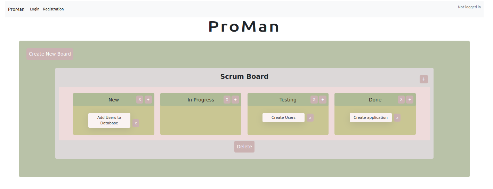

# PROMAN

Practical scrum-board, where you and your team can add, delete and edit boards, columns and cards. 


## Dependencies

- python3, pip
- postgres

## Environment Variables

To run this project, you will need to add the following environment variables to your .env file:

`MY_PSQL_DBNAME`

`MY_PSQL_HOST` (if run locally, just localhost)

`MY_PSQL_USER`

`MY_PSQL_PASSWORD`


## Run Locally

Clone the project

```bash
  git clone https://github.com/CodecoolGlobal/proman-1-python-Dealibros
```

Go to the project directory

```bash
  cd proman-1-python-Dealibros
```

Install dependencies (virtual enviroment recommended)

```bash
  cd frontend/day-to-day-planner
  pip install -r requirements.txt
```

Start the flask app: 

```bash
  python3 main.py
```

The app is now running on port 5000. 

## Authors

- [@Damos222](https://github.com/Damos222)
- [@Dealibros](https://github.com/Dealibros)
- [@derfabio](https://github.com/derfabio)
- [@dorianamaria96](https://github.com/dorianamaria96)
- [@IkaPata](https://github.com/IkaPata)
- [@RaffaelBoda](https://github.com/RaffaelBoda)
- [@shirelkatz](https://github.com/shirelkatz)


## Screenshot




## Roadmap

- [x]  Setup project
- [x]  Create / delete / edit boards
- [x]  Create / delete / edit columns
- [x]  Create / delete / edit cards
- [x]  Change the order of the cards
- [x]  User Registration, Login, Logout
- [x]  Public and private boards

